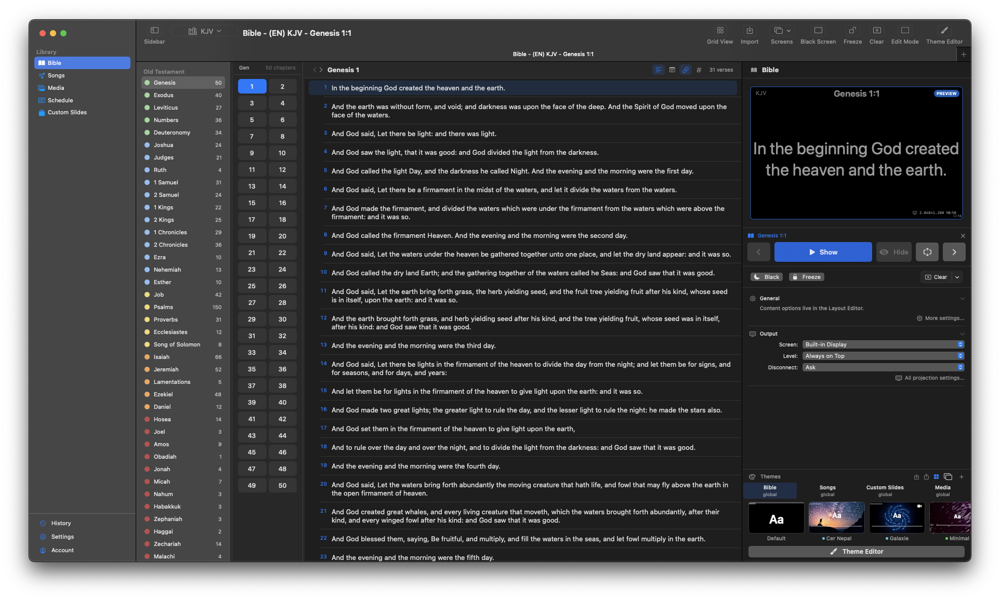
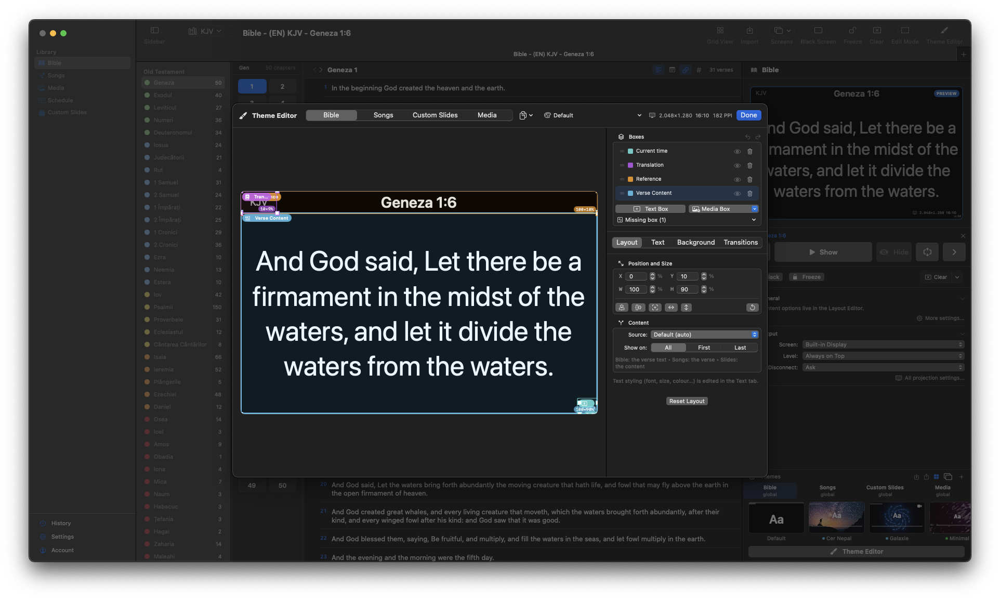
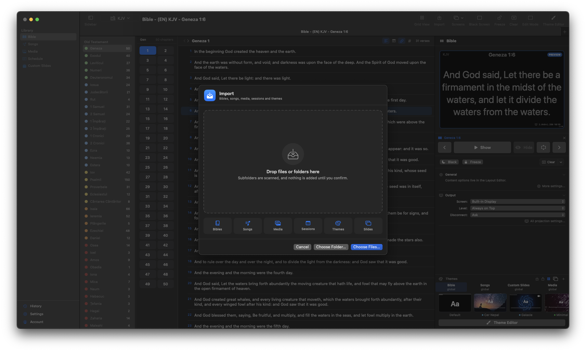
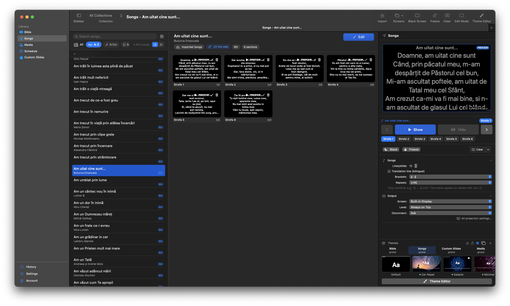

<p align="center">
  
</p>

<h1 align="center">TopPresenter</h1>

<p align="center">
  Bible and worship presentation for macOS.<br>
  Native SwiftUI. No Electron, no subscription, no cloud account.
</p>

<p align="center">
  <a href="https://github.com/RobyRew/TopPresenter/releases/latest"></a>
  
  
</p>

<p align="center">
  
</p>

---

## What it does

Put scripture, lyrics, images, video and PDF slides on a projector, and control how all of it looks from one place.

- **Read and project any Bible.** 70 translations available as a free download, in 17 languages — or bring your own from OSIS, Zefania, MySword, USFM and Unbound.
- **Sing from a real song library.** Multiple versions per song, inline chords, live transpose, bilingual lines, and imports from OpenSong, OpenLyrics, ChordPro, plain text and PowerPoint.
- **Design the look once.** A theme covers every presenter at once — Bible, Songs, Slides, Media — and travels between machines as a single file.
- **Nothing freezes.** Importing seventy Bibles or deleting them runs in the background with a progress bar you can cancel, while you keep working.

## Install

Download the latest `.dmg` from [**Releases**](https://github.com/RobyRew/TopPresenter/releases/latest), drag it to Applications, and open it. The app updates itself from then on.

Then get the content:

| | |
|---|---|
| [**Bible Library**](https://github.com/RobyRew/TopPresenter/releases/tag/bibles-1) | 70 translations, 17 languages, 1.7M verses |
| [**Themes**](https://github.com/RobyRew/TopPresenter/releases/tag/themes-1) | 21 themes — photo, motion and plain-colour backgrounds |

Unzip, then **Import** → choose the folder. Subfolders are scanned, and nothing is added until you confirm.

---

## The theme editor

<p align="center">
  
</p>

Every box on screen is yours to place, style and stack. Boxes are **fixed** — text flows inside them, so a long verse never shoves your reference off the slide.

<details>
<summary><b>What you can put in a box, and how it can look</b></summary>

<br>

**Sources** — a box can show the live lyric or verse, the title, the reference, the translation name, the section label, a slide counter (`2 / 7`), a clock, a date, or static text you type once (church name, CCLI number, "Amin.").

**Styling** — font, size up to 200pt, weight, colour, alignment, vertical alignment, opacity, line spacing, letter spacing, UPPERCASE/lowercase, padding, shadow colour and radius, and auto-fit. Set it globally, or override it per box.

**Scope** — show a box on every slide, only the first, or only the last. Songs add *chorus* and *verses* as scopes, so a song title on slide one and "Amin." on the last is two clicks.

**Media boxes** — images, animated GIFs or looping video as overlays, with opacity, corner radius, edge feather and fit/fill.

**Chords** — a song-only box that renders chords above the lyrics, each aligned over its syllable, with typography independent of the lyric text. Transpose and capo are live and display-only: your saved chords are never touched.

**Transitions** — three phases (in, between slides, out), 14 effects, per-phase durations, per-box overrides with stagger.

Undo and redo cover every layout change, grouped per gesture.

</details>

<details>
<summary><b>Per-presenter profiles</b></summary>

<br>

Bible, Songs, Custom Slides and Media each keep their own boxes, styles, backgrounds and transitions. The output always renders the profile belonging to whatever is live, so switching from a verse to a song restyles the screen without you touching anything.

Copy a layout from one presenter to another with one click when you want them to match.

</details>

---

## Import

<p align="center">
  
</p>

One screen for everything. Drop a file, a folder, a folder of folders, or a mix of types — it tells you what it found before it imports anything, and lists what it skipped with the reason.

<details>
<summary><b>Every format it reads</b></summary>

<br>

| | Formats |
|---|---|
| **Bible** | TopPresenter Bible (`.tpbible`) · OSIS XML · Zefania XML · MySword SQLite · USFM (file or folder) · Unbound Bible |
| **Songs** | TopPresenter Song (`.tpsong`, `.tpsongcollection`) · OpenSong XML · OpenLyrics XML · ChordPro (`.cho`, `.crd`, `.chordpro`) · Plain text · PowerPoint (`.pptx`, `.ppt`) |
| **Media** | Images (jpg, png, gif, heic, tiff, bmp, webp, svg) · Audio (mp3, wav, aac, m4a, flac, ogg, aiff) · Video (mp4, mov, mkv, webm, m4v) · **PDF** |
| **Documents** | Themes (`.tptheme`) · Sessions (`.tpschedule`) · Slides (`.tpslides`) |

Everything TopPresenter writes, it can read back without losing a field — including the parts most formats drop: red-letter words of Christ, section headings, footnotes, cross-references, Strong's numbers, poetry indentation, song versions, chord positions and bilingual lines.

</details>

<details>
<summary><b>Duplicates, and what happens on a second import</b></summary>

<br>

Importing the same file twice is a no-op. Every kind of content is matched on identity *and* on a fingerprint of its contents, because "you already have this exact file" and "you have something else with the same name" deserve different answers.

- **Identical** → skipped silently, and counted in the summary.
- **Same name, different content** → it asks, and tells you *how* they differ ("same abbreviation, 31,102 vs 31,086 verses").
- **Bibles** can be merged, which fills in only the chapters you are missing.
- **Songs** can be added as a new version of the song you already have.
- **Duplicates inside one drop** are caught too: two copies of the same file under different names, and only the first is ticked.

</details>

<details>
<summary><b>Why it no longer freezes</b></summary>

<br>

Importing and deleting run on a background actor with their own database context, and report into a strip at the bottom of the window with elapsed time, an estimate, and a Stop button. You can close the import sheet and keep working; the job carries on.

Bulk deletes run as SQL rather than by loading every row into memory first — measured on a real Bible, that is **7.97s → 0.17s** per module.

</details>

---

## Presenting

The output window is transparent and borderless, opens on whichever screen you choose, and shows nothing at all when idle — no logo, no placeholder, no chrome.

<details>
<summary><b>Controls and shortcuts</b></summary>

<br>

| Key | |
|---|---|
| `Return` | Show / hide |
| `← →` | Previous / next verse or slide |
| `Escape` | Clear the output |
| `⌘B` | Black screen |
| `⌘F` | Freeze |
| `⌘⎋` | Panic — drop the output off the screen immediately |
| `⌘K` | Quick search across Bible, songs and slides |
| `⌘T` | New tab |
| `⌘1`–`⌘5` | Bible · Songs · Media · Schedule · Custom Slides |
| `⌘Y` | Presentation history |
| `⌘+click` | Select multiple verses |
| double-click | Present immediately |

**Single display?** The output hides itself whenever it would cover your own screen, and comes back on Show.

</details>

<details>
<summary><b>Tabs, history and search</b></summary>

<br>

**Tabs** (`⌘T`) — each tab holds its own module, Bible translation and selection, and is titled by what it contains (*Bible - (RO) EDC100 - Ioan 3:16*). One output, driven by whichever tab presses Show.

**History** (`⌘Y`) — a record of everything the congregation actually saw: which songs, which passages, how many times, in which service. Verses are only logged after a few seconds on screen, so scrubbing does not pollute it. Kept in its own database, with its own CSV and JSON export.

**Quick search** (`⌘K`) — Bible, songs and slides at once. Type `John 3:16` or `Gen 1:1-3` to jump straight to a passage. Everything is indexed in Spotlight too.

</details>

---

## Songs

<p align="center">
  
</p>

Sections split into slides automatically, and the preview on the right is your actual theme — what you see is what the projector gets.

<details>
<summary><b>Versions, chords and the editor</b></summary>

<br>

A song is a group of renditions, not a single text. Each version carries its own title, authors, language, key, capo, tempo, copyright, CCLI number, songbook, style, themes and notes — inheriting the original's values until you decide otherwise.

The editor is two panes: section cards you can reorder, duplicate and mark `×N`, and a live preview rendered with your actual theme that follows whichever section you click. There is a **Verified** flag for songs you have checked, a filter for it, and a change log per song.

Slides split at whatever line count you set, with repeat markers (`/: :/`, `‖: :‖`, `(×2)`, *bis*) drawn the way the theme says.

The browser handles a real library — list or grid, indexed search, sort by title, artist, songbook, language or recency, and filters for collection, language, media and verified-only.

</details>

<details>
<summary><b>Getting songs in</b></summary>

<br>

Point it at a folder of thousands of files and it will work through them with progress and duplicate handling. Four userscripts are included for building a library from the web:

| Script | Site |
|---|---|
| [`eBiblia-Scraper.user.js`](scrapers/eBiblia-Scraper.user.js) | ebiblia.ro — exports whole Bible translations |
| [`melodia-scraper.user.js`](scrapers) | melodia.ro |
| [`cantaricrestine-scraper.user.js`](scrapers) | cantaricrestine.ro |
| [`worshiptogether-scraper.user.js`](scrapers) | worshiptogether.com (EN / ES / PT) |

They run in Tampermonkey or Violentmonkey on Chrome, Firefox and Safari, and export straight into TopPresenter's own formats.

> Respect each translation's and each song's copyright — export for personal and congregational use.

</details>

---

## Everything else

<details>
<summary><b>Media, PDF, schedules and slides</b></summary>

<br>

**Media** is referenced where it lives, never copied into a library folder, so nothing is duplicated on disk. Grid with thumbnails, type filter, audio player with speed and seek, video looping, and *Reveal in Finder*.

**PDF** is presented a page at a time. The arrows beside Present turn pages on the live output instead of skipping to the next file. Export slides from Keynote or PowerPoint as PDF to show them here.

**Schedules** hold a service running order you can go live from. **Custom slides** are free text, with tokens that can pull in live or even remote content — a dead network can never fail a presentation, only fall back to the last good value.

</details>

<details>
<summary><b>Languages, files and updates</b></summary>

<br>

Contributions welcome — see below.

<!-- i18n-coverage:start -->

**1303 translatable strings.** Regenerated on every commit — do not edit by hand.

| | Language | Progress | Done |
|---|---|---|---|
| 🇬🇧 | **English** (`en`) | `████████████████████████` 100% | ✅ |
| 🇷🇴 | **Română** (`ro`) | `████████████████████████` 100% | ✅ |
| 🇪🇸 | **Español** (`es`) | `████████████████████████` 100% | ✅ |
| 🇫🇷 | **Français** (`fr`) | `████░░░░░░░░░░░░░░░░░░░░` 16% | 210/1303 |
| 🇩🇪 | **Deutsch** (`de`) | `████░░░░░░░░░░░░░░░░░░░░` 16% | 210/1303 |
| 🇷🇺 | **Русский** (`ru`) | `████░░░░░░░░░░░░░░░░░░░░` 16% | 210/1303 |

<!-- i18n-coverage:end -->

Six document types are registered with macOS, each with its own Finder icon and openable by double-click: `.tpbible` `.tpsong` `.tpsongcollection` `.tpslides` `.tpschedule` `.tptheme`. They are all JSON underneath, so you can read, diff and edit them with ordinary tools.

The app updates itself, with an opt-in beta channel.

</details>

<details>
<summary><b>Roadmap</b></summary>

<br>

- Stage display — next slide, clock, speaker notes
- Remote control from a phone or tablet
- Interlinear and Strong's in the Bible reader (the data is already stored)
- NDI / Syphon output for video mixers
- Cloud sync for themes and libraries

</details>

---

## Contributing

<details>
<summary><b>Building from source</b></summary>

<br>

```bash
git clone https://github.com/RobyRew/TopPresenter.git
cd TopPresenter
open TopPresenter.xcodeproj
```

Select the **TopPresenter** scheme and run (`⌘R`). Requires macOS 15.7+ and Xcode 16.3+.

```bash
xcodebuild -scheme TopPresenter -destination 'platform=macOS' test -only-testing:TopPresenterTests
```

Design decisions and the rules that are easy to break live in [`AGENTS.md`](AGENTS.md).

</details>

<details>
<summary><b>Translating</b></summary>

<br>

Strings live in `TopPresenter/Localizable.xcstrings`, editable in Xcode's String Catalog editor. English is the base language: a key with no English entry falls through to the raw key text for *everyone*, so fill that in first.

```bash
python3 scripts/i18n_coverage.py          # regenerate the coverage table
python3 scripts/i18n_coverage.py --check  # fails if the table is stale
```

</details>

<details>
<summary><b>Project layout</b></summary>

<br>

```
TopPresenter/
├── Core/          PresentationManager (state, profiles, themes, transitions),
│                  commands, search, Spotlight, updates
├── Models/        BibleModule, Song, MediaItem, Schedule, LiveContent
├── Services/
│   ├── Import/    the format catalog, scanner, duplicate resolver, coordinator,
│   │              and one importer per format
│   ├── Export/    the native formats and their naming
│   ├── Library/   background delete, export and progress
│   ├── Media/     import, presenting, PDF rendering
│   └── Sessions/  service schedules
├── Views/
│   ├── Main/      window, sidebar, preview panels, tabs, import sheet
│   ├── Presentation/  output window, theme editor, text and media boxes
│   └── …          one folder per module
└── scripts/       theme pack builder, background generator, i18n coverage
```

</details>

---

<p align="center">
  <sub>Apache 2.0 — see <a href="LICENSE">LICENSE</a> and <a href="NOTICE">NOTICE</a>.</sub>
</p>
